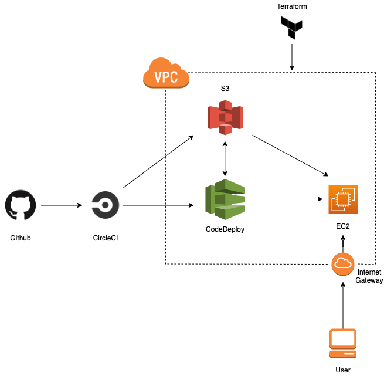

# devops_interview
This is a hands-on assessment of Infrastructure-as-Code (IaC), CI/CD, and public cloud providers. You may use GCP or AWS as the platform of your choice; you may use `gcloud deployment-manager`, `aws cloudformation`, or `terraform` command-line interface tools. Please do not spend more than 2 hours on this task. You're not expected to setup your own personal cloud account, but there should be enough configuration details so that deploying to a real cloud environment will theoretically work. Be prepared to justify your design.

## Setup:
1. Fork this repo into your own Github account
2. Add user `tonybenchsci` to your forked repo with read access
3. Setup a [free CircleCI accout](https://circleci.com/docs/2.0/first-steps/) and hook up your repo

## Background:
A simple Flask webserver that displays "Hello World from BenchSci!" runs on a Virtual Machine on the cloud. The VM that runs it has several firewall rules associated. The firewall rules are:
- Allow all egress
- Deny all ingress, but allow:
```
TCP Ports 80, 443 from everywhere on the internet
ICMP (ping) from  everywhere on the internet
TCP Port 22 from 104.154.0.0/15 (GOOGLE LLC)
Allow all tcp/udp internal traffic within the VPC
```

## The problem:
The above cloud-native application was manually configured using Web console UIs, and it was accidently deleted by a junior developer. None of the cloud firewall rules were captured in IaC, and neither is the VM configuration. Your assignment is to create the cloud resources in configuration files, and setup CI/CD to create/update the rules based on code changes in the master branch. This would allow arbitrary deploys of the application stack, resilient to incidents. It also allows a team of DevOps engineers to collaborate on new infrastructure definitions.

## Requirements:
- Complete `./circle/config.yml` file that installs CLI tools as needed, configures auth, performs basic sanity tests, and deploys resources.
- Configuration file(s) that define a VPC network that the VM lives in, Firewall rules / Security groups, and a single VM
- (Theoretically deployed) VM runs the python webserver defined in `app.py` on startup and any restarts
- (Theoretically deployed) Working public IP address to see "Hello World from BenchSci!" in a web browser
- Basic Documentation (README.md) and architecture diagram
- Avoid: Unnecessary abstractions in the form of configuration templates and/or modules

## Solution:

The following statement provies a brief overview of the technical architecture. The solution is split into two parts. The first part covers infrastructure as code (IaC) and the second part covers the CI/CD pipeline. 

# Infrastructure as Code:

The mission statement states that the initial configuration was manually setup and our goal is to capture this configuration with Infrastructure as Code. This allows the DevOps team to deploy infrastructure with the push of a button, version control all infrastructure changes and prevent future outages. This solution deploys the following resources:

- VPC, Internet Gateway, Public Subnet, Route Table, Security Group, Ingress/Egress Rules & EC2 Instance.

Steps to replicate:

*Note: These steps can be run from your local/development machine.*

- Install Terraform
- Install awscli
- Log into AWS Console and create Access Keys (Only recommended for local machine. If you run a CI/CD tool like CircleCI/Jenkins on a dedicated EC2, please attach an AWS IAM role with permissions to provision the above listed resources.)
- Clone this repository and change directories to the Terraform folder.
- Run the following commands to deploy your infrastructure:

        >  terraform init
        >  terraform plan
        >  terraform apply

Note: Since the mission statement didn't require the DevOps tools like CircleCI, AWS CodeDeploy etc abstracted, unnecessary abstractions were avoided. Please note that in order to use AWS CodeDeploy, and S3 as a source repository for revisions of your application you do require AWS IAM roles to be created for AWS CodeDeploy, AWS EC2 and S3 Bucket Policies. The details and steps are covered at https://docs.aws.amazon.com/codedeploy/latest/userguide/getting-started-codedeploy.html

*PS: If you would like to ssh into your EC2 and check configurations, a Key value with the name "Docker" has been entered into main.tf. You can replace this with name of Key pair you would like to associate with your EC2 and use it to SSH in. You would require to change SSH security group rules to allow SSH access however.  

# CI/CD

The mission statement states CircleCI as a requirement for the build and deployment of a simple Hello World application to a VM on the cloud. The solution looks for a commit in the master branch which serves as a triger to start our CI/CD pipeline. After installing dependencies from the requirements.txt file, it runs a unit test against our Flask application. This test looks for a 200 OK status code when our application is started and also conducts a sanity test to confirm "Hello World from Benchsci!" is produced. Two reports are generated as a result of our unit tests. The deploy jobs installs dependencies to run aws cli commands, packages our source code, pushes it to S3 as a Zip, and calls AWS CodeDeploy to deploy that revision to our EC2 instance. 

*Note: To authorize resource deployments from CircleCI to AWS, please configure AWS Access Keys in your CircleCI project. If you are using a dedicated CircleCI server, you should you IAM Roles instead of Access Keys.*

Steps to replicate:

- Fork this repository.
- Sign up for CircleCI and authenticate with Github to allow access to this repository.
- Create an S3 bucket to store code revisions. (Create a bucket policy to allow CircleCI to access this bucket)
- Navigate to AWS CodeDeploy in the UI amd create an Application, Deployment Group, IAM Role for AWS CodeDeploy and select your EC2 Tag as your deployment target. These steps can also be done via CLI.)
- Once you are finished, you are ready to test. The appspec.yml file in our config takes care of copying the revision of our source code to our EC2 and runs scripts from inside the Script folder to start and stop our application during deployment.

*Note: AWS CodeDeploy requires an agent running on your EC2, which in our case is already done via a user script passed to our EC2 at launch. This user script covers installation of basic tools and application requirements like pip and Flask.*

Finally, make a change in your configuration and trigger the CI/CD pipeline. A new revision of your application should be visible at the Public-IP/hello endpoint on your browser. :triumph:



